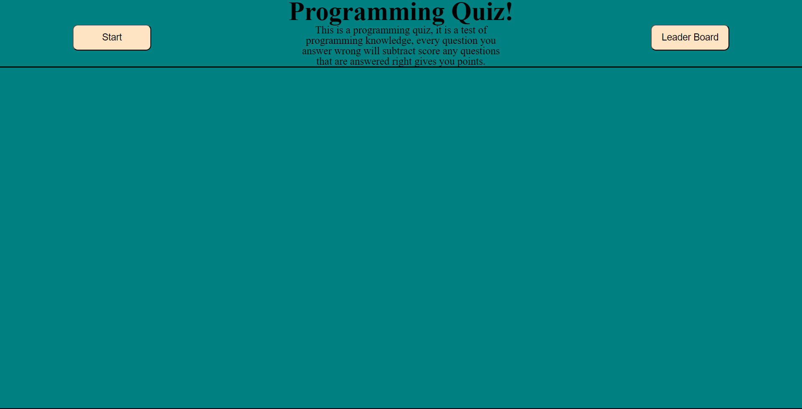
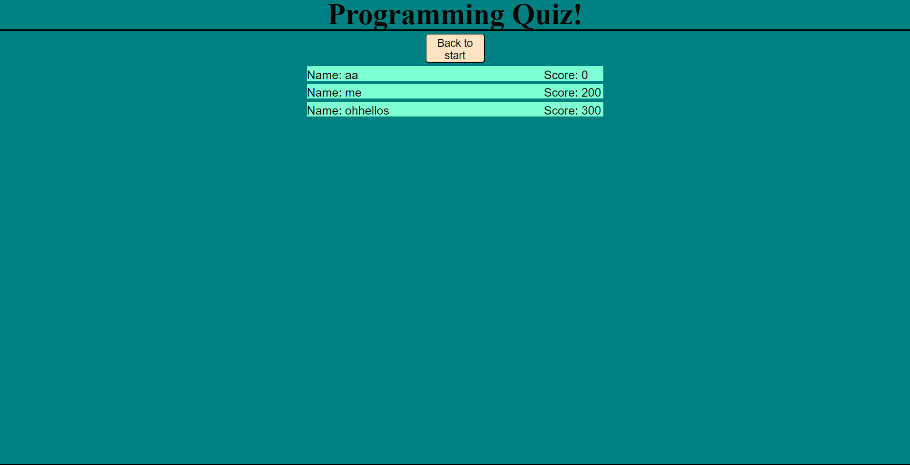
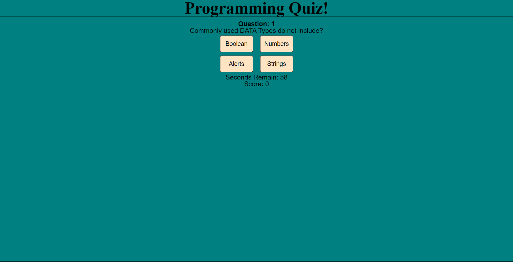
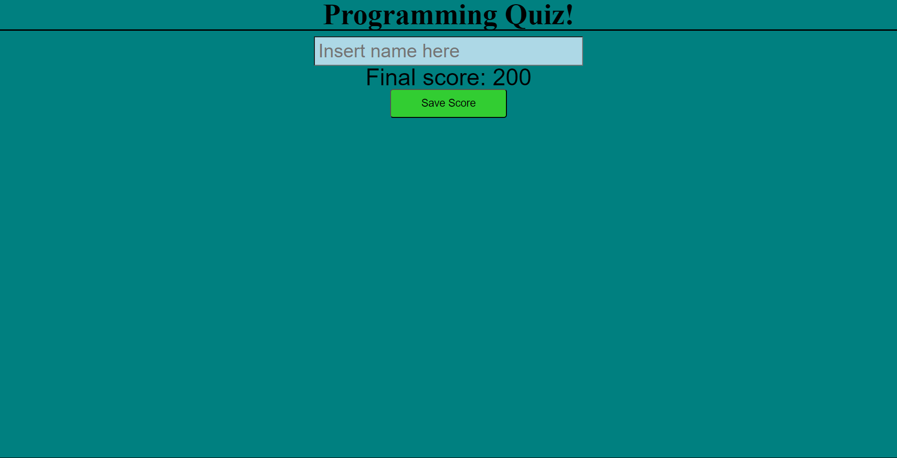

# Coding-Quiz

## Description

### User Story: 
```
AS A coding boot camp student
I WANT to take a timed quiz on JavaScript fundamentals that stores high scores
SO THAT I can gauge my progress compared to my peers
```

This is a Coding Quiz, the displayed website have a start button for the quiz as well as a leader-board button to display previous scores.
the quiz will ask a series of questions and will award points for getting them right or remove time if you get them wrong. 

## Installations
N/A

## Usage

### Acceptance Criteria:
```
GIVEN I am taking a code quiz
WHEN I click the start button
THEN a timer starts and I am presented with a question
WHEN I answer a question
THEN I am presented with another question
WHEN I answer a question incorrectly
THEN time is subtracted from the clock
WHEN all questions are answered or the timer reaches 0
THEN the game is over
WHEN the game is over
THEN I can save my initials and score
```
The quiz is a demonstration of coding skills, in the quiz's code it achieves the above criterias, it also demonstrates styling in css with hovor elements and usage of flex boxes. Using the code from this Quiz will be reference for future assignments to aid me using different javascript functions and will also be a demonstation of capabilities to future employers.
## Link
https://brandonerivera.github.io/Coding-Quiz/
## Images



